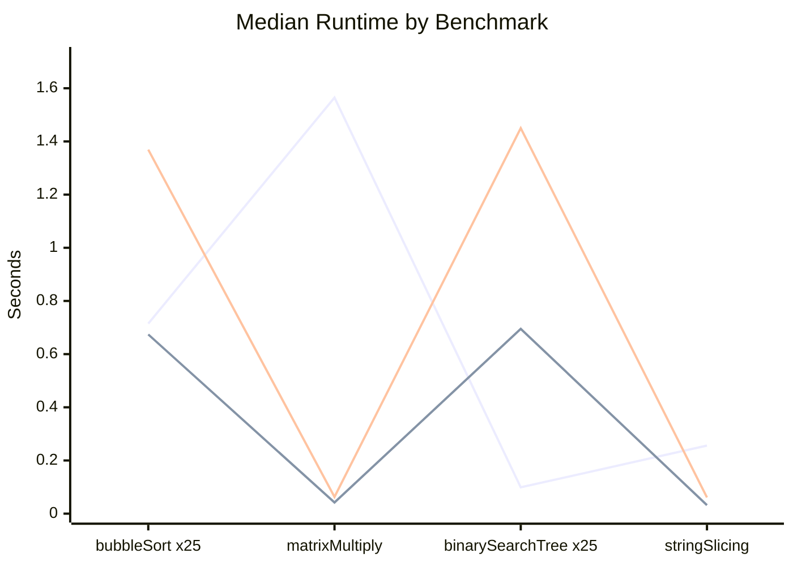

# GiavaScript

[](https://github.com/memburg/GiavaScript/actions/workflows/test.yml)


GiavaScript is an open-source, cross-platform, non-standard-compliant JavaScript runtime environment.

## Install (optimized build)

Build and install the `giavascript` executable globally:

```bash
./install.sh
```

This compiles with Crystal release optimizations and installs to `/usr/local/bin` by default.

If you prefer a user-local location:

```bash
INSTALL_DIR="$HOME/.local/bin" ./install.sh
```

## Run a Source File

```bash
giavascript path/to/program.js
```

The interpreter reads the file and executes it through the same evaluation pipeline used for in-memory strings.

## Run the REPL

```bash
giavascript
```

Exit with:

```txt
:quit
```

## JavaScript Feature Reference

Use the reference docs to track which standard JavaScript features are currently available:

- [Consolidated Reference](reference/REFERENCE.md)

Table of Contents:

- [Language](reference/Language.md)
- [Types](reference/Types.md)
- [Math](reference/Math.md)
- [JSON](reference/JSON.md)

Regenerate the consolidated file with:

```bash
python3 scripts/generate_reference.py
```

or the short wrapper:

```bash
./scripts/reference.sh
```

## Current Limitations

- Partial JavaScript support; many standard globals and language features are still missing.

## Benchmarks

Monthly benchmark results are committed to `benchmarks/performance-comparison-latest.csv` by the GitHub Actions workflow. The chart below uses median execution time in seconds from the latest run (lower is better).


